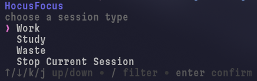

# hocusfocus



*hocusfocus* is a terminal-based productivity tracker written in Rust!,

[](https://deepwiki.com/indium114/hocusfocus)

## Installation

### from the Binary

Go to the *Releases* section on the right, click the latest release, and click the binary for your OS and architecture to download it.

### with [wares](https://github.com/indium114/wares)

Add the following to your `config.yaml` file (note: remove the `wares:` key and put it under your top-level `wares` key):

```yaml
wares:
  hocusfocus:
    name: hocusfocus
    repo: indium114/hocusfocus
    asset: "hocusfocus_Linux_x86_64"
```

## Usage

Run the `hocusfocus` command to enter the main interface

There are **three** session types to choose from: `Work`, `Study`, and `Waste`.
> if none of these session types apply to what you're doing, choose the `Custom` session type and type in what you're doing.

Use the `arrow keys` to navigate up and down, and use the `enter` key to select an option.

Press `enter` on one of the session types to start tracking it. When you are done, press `stop` to stop, or press another session's name to switch to that session.

Running `hocusfocus` with the `stats` argument will print how long you've spent in total in each session.

Running `hocusfocus` with the `currentsession` argument will print the current session to the terminal.
